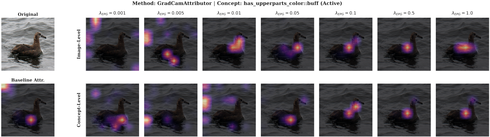
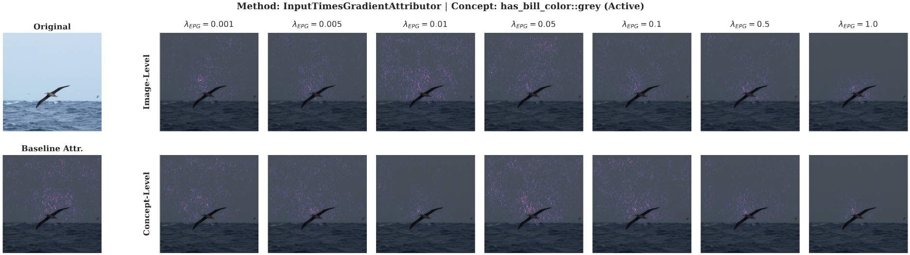
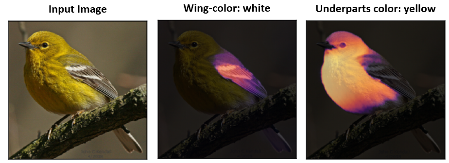
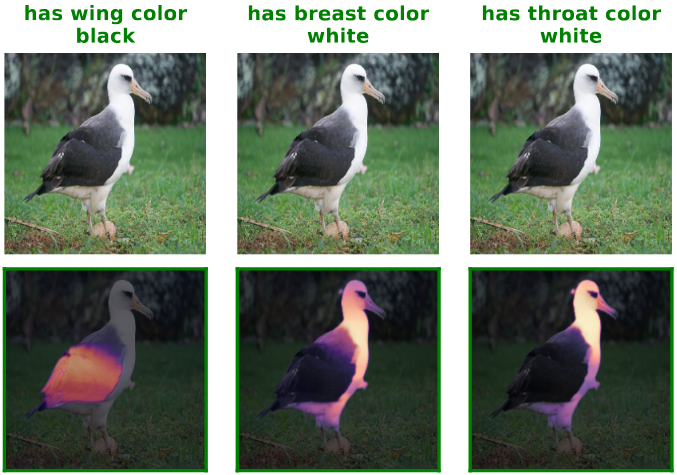
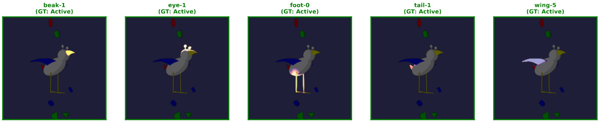
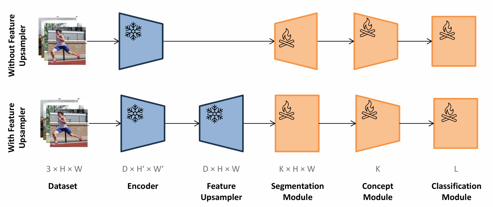

# Master Thesis - Zooming into Concepts: Toward High-Resolution and Spatially Grounded Concepts in Concept Bottleneck Models

This repository contains the code used for the experiments in my master
thesis.\
The project implements **Guided Concept Bottleneck Models (GCBM)** and
**Extended CBMs (ECBM)** for interpretable image classification.

The repository includes the full training pipeline, attribution methods,
losses, and experiment configurations used in the thesis.

Guided CBM examples:


------------------------------------------------------------------------

Extended CBM examples:



------------------------------------------------------------------------

# Repository Setup

## 1. Clone the Repository

First clone the repository:

``` bash
git clone git@github.com:roesch01/gcbm-ecbm.git
```

------------------------------------------------------------------------

# External Dependencies

This project depends on two external repositories that must be installed.

## SegDINO

Clone **SegDINO** and place it inside this repository in `gcbm-ecbm/segdino`.

Repository: https://github.com/script-Yang/SegDINO

``` bash
cd gcbm-ecbm
git clone https://github.com/script-Yang/SegDINO.git segdino
```

------------------------------------------------------------------------

## DINOv3

Clone **DINOv3** outside of this repository as well.

Repository: https://github.com/facebookresearch/dinov3

``` bash
cd ..
git clone https://github.com/facebookresearch/dinov3.git dinov3
```
Follow their instructions to download and implement the weights. We use ``vit_base_patch16_dinov3.lvd1689m``.

------------------------------------------------------------------------

# Python Environment

The project uses the package manager **uv**.

Install instructions:\
https://docs.astral.sh/uv/getting-started/installation/

Example installation:

``` bash
curl -LsSf https://astral.sh/uv/install.sh | sh
```

Check installation:

``` bash
uv --version
```

Expected version used for the thesis:

    uv 0.9.7

------------------------------------------------------------------------

## Install Python Dependencies

All Python dependencies are defined in `pyproject.toml`.

Create and sync the environment:

``` bash
uv sync
```

------------------------------------------------------------------------

# Environment Variables

The project expects several environment variables to be defined.

Example configuration:

``` bash
export ROOT_DIR_WORKSPACE="/path/to/your/workspace"
export ROOT_DIR_CODEBASE="$ROOT_DIR_WORKSPACE/gcbm-ecbm"
export ROOT_DIR_DATASET="$ROOT_DIR_WORKSPACE/datasets"

export HF_HOME="$ROOT_DIR_WORKSPACE/.cache/huggingface"
export HF_DATASETS_CACHE="$ROOT_DIR_WORKSPACE/.cache/huggingface"

export PYTHONPATH="$ROOT_DIR_CODEBASE"
export TORCH_HOME="$ROOT_DIR_WORKSPACE/.cache"
export BLOB_DIR="$ROOT_DIR_WORKSPACE/blobs"
```

------------------------------------------------------------------------

# Dataset Setup

All datasets must be placed in the directory specified by:

    $ROOT_DIR_DATASET

Two datasets are required:

    $ROOT_DIR_DATASET
    │
    ├── FunnyBirds
    └── CUB

Follow the instructions:
- FunnyBirds: https://github.com/visinf/funnybirds
- CUB-112: https://www.vision.caltech.edu/datasets/cub_200_2011/
------------------------------------------------------------------------

## CUB Concept Masks

The repository expects precomputed concept-level segmentation masks for
CUB.

The file:

    concept_masks_sam2.tar.zst

must be located inside the **CUB dataset directory**. Download it here: https://drive.google.com/file/d/16MZZhlEA_rfCKgNyTBVofM4gn5oEoywC/view?usp=sharing.

Example:

    $ROOT_DIR_DATASET/CUB/concept_masks_sam2.tar.zst

Extract the masks using:

``` bash
tar -I zstd -xvf concept_masks_sam2.tar.zst
```

This will create the directory:

    concept_masks_sam2/

which contains the segmentation masks used for concept supervision.

------------------------------------------------------------------------

# Repository Structure

    .
    ├── train_epg.py
    ├── train_cbm_extended.py
    ├── array-job-epg.py
    ├── array-job-extended.py
    │
    ├── architecture
    │   └── model definitions for GCBM and Extended CBM
    │
    ├── utils
    │   ├── attribution methods
    │   ├── loss functions
    │   └── helper utilities
    │
    ├── test_grid_experiments_epg.csv
    └── test_grid_experiments_extended.csv

### Architecture Package

The **architecture package** defines the model architectures used in the
thesis:

-   Grounded Concept Bottleneck Model (GCBM)
-   Extended Concept Bottleneck Model (ECBM)

### Utils Package

The **utils package** contains:

-   attribution methods
-   loss functions
-   evaluation utilities

------------------------------------------------------------------------

# Model Training

## GCBM Training

Training can be started directly with:

``` bash
uv run python train_epg.py
```

All available parameters can be inspected via:

``` bash
uv run python train_epg.py --help
```

------------------------------------------------------------------------

## Grid Experiments

Experiment configurations can also be defined in:

    test_grid_experiments_epg.csv

Each row defines a training configuration.

A specific run can be started using:

``` bash
SLURM_ARRAY_TASK_ID=LINENUMBER uv run python array-job-epg.py
```

where `LINENUMBER` corresponds to the row in the CSV file.

------------------------------------------------------------------------

# Extended CBM Training

Extended CBM experiments work analogously.

Configurations are defined in:

    test_grid_experiments_extended.csv

To start a run:

``` bash
SLURM_ARRAY_TASK_ID=LINENUMBER uv run python array-job-extended.py
```

Alternatively training can be started directly via:

``` bash
uv run python train_cbm_extended.py
```

------------------------------------------------------------------------

# ECBM Architecture



------------------------------------------------------------------------

# Notes

-   The repository was developed and tested using **uv 0.9.7**.
-   External dependencies (**SegDINO** and **DINOv3**) must be installed
    manually.
-   Large datasets are not included in this repository.

------------------------------------------------------------------------

# License

This repository accompanies a master thesis and is intended for research
purposes.
